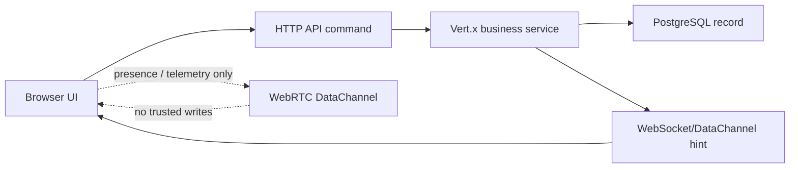

# YINILOW Realtime DataChannel Architecture

## Decision

YINILOW will use WebRTC DataChannel where it is safe for speed and realtime feel, while keeping trusted records and business decisions in the Vert.x backend and PostgreSQL.

Browsers already provide WebRTC DataChannel support. `libdatachannel` is useful if YINILOW later adds a native C/C++ realtime worker, media gateway, or edge service. The current React + Vert.x platform should not embed native C++ inside the Java API service unless a server-side peer becomes necessary.

## Safe DataChannel Use

DataChannel is approved for low-risk, fast-moving, disposable events:

- Dig the Pile room presence
- live cursors, gestures, taps, scroll position, and hover intent
- seller/admin dashboard telemetry
- latency probes and connection quality
- typing/inspection indicators
- temporary product-room reactions
- local optimistic UI hints that can be corrected by the backend

These events may be unordered and lossy. They improve feel, but they do not create business records.

## Not Allowed Over DataChannel

These must use authenticated Vert.x APIs, server validation, and PostgreSQL records:

- checkout
- payment initialization or confirmation
- item holds, claims, reservations, or stock ownership
- listing creation and visibility changes
- seller login, logout, approval, suspension, or payout state
- refunds, disputes, delivery records, inventory custody, and audit events
- anything that changes money, stock, identity, permissions, or customer promises

## Current Implementation

- `GET /api/v1/realtime/signaling/:roomId`
  - WebSocket signaling room used only to exchange WebRTC offer, answer, and ICE messages.
  - Room ids are restricted to safe characters and length.
  - Signaling messages are capped at 16 KB.

- `src/realtime.js`
  - Creates a browser `RTCPeerConnection`.
  - Uses an unordered, zero-retry `yinilow.telemetry` DataChannel for fast telemetry.
  - Exposes `sendTelemetry(payload)` and `close()`.

## Record Flow

## Operating Rule

If losing, duplicating, delaying, or faking an event would damage orders, stock, seller trust, customer promises, or money, it does not belong on DataChannel.
